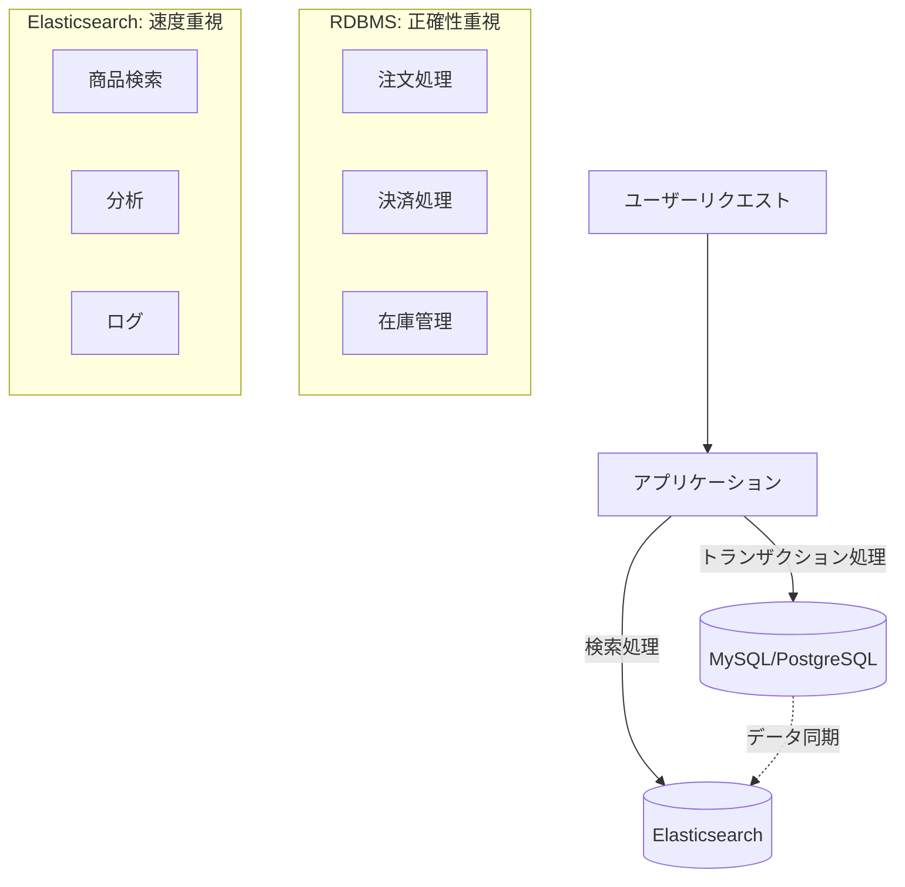

# はじめに

「Elasticsearchって何？RDBMSと何が違うの？」

MySQL、PostgreSQL、Oracle DBなどのRDBMSを使い慣れた開発者にとって、Elasticsearchは一見謎の多い技術に見えるかもしれません。しかし、実際にはRDBMSでは解決困難な特定の問題を解決するために生まれた、非常に理にかなった技術なのです。

本記事では、**RDBMSしか知らない開発者**を対象に、普段使っているSQLやテーブル設計の知識を活用しながら、Elasticsearchがどのような技術なのかを段階的に解説していきます。

## あなたがRDBMSで困ったことはありませんか？

まず、以下のような経験はないでしょうか：

- **検索が遅い**: 商品名や説明文での部分一致検索で`LIKE '%keyword%'`を使ったら、データ量が増えて激重になった
- **全文検索の限界**: 「プログラミング 入門」で検索したとき、「入門 プログラミング」の記事がヒットしない
- **スケールの壁**: サーバーを高スペックにしても限界があり、アクセス増加に対応できない
- **JSON検索の困難**: カラムにJSONを格納したが、その中身での複雑な検索ができない

これらの問題を解決するために作られたのがElasticsearchです。

## 学習アプローチ：RDBMSとの対比で理解する

本記事では、あなたが既に知っているRDBMSの概念と直接比較しながら、Elasticsearchを学んでいきます：

| RDBMSの概念 | Elasticsearchの概念 | 何が違うのか |
|-------------|---------------------|-------------|
| データベース | インデックス | 格納方法が根本的に異なる |
| テーブル | ドキュメントタイプ | スキーマの柔軟性が全く違う |
| 行(レコード) | ドキュメント | JSON形式で関連データを一箇所に |
| 列(カラム) | フィールド | 動的に追加可能 |
| SQL | Query DSL | JSON形式のクエリ言語 |

各章で、まずRDBMSでの従来の方法を示し、次にElasticsearchではどう変わるかを具体例とともに説明します。

---

# 1. データの格納方法：テーブル vs ドキュメント

## あなたが知っているRDBMSの方法

RDBMSでは、データを以下のように構造化して格納します：

```sql
-- 顧客テーブル
CREATE TABLE customers (
    id BIGINT PRIMARY KEY,
    name VARCHAR(100) NOT NULL,
    email VARCHAR(255) UNIQUE,
    created_at TIMESTAMP DEFAULT CURRENT_TIMESTAMP
);

-- 注文テーブル
CREATE TABLE orders (
    id BIGINT PRIMARY KEY,
    customer_id BIGINT,
    amount DECIMAL(10,2),
    status VARCHAR(50),
    FOREIGN KEY (customer_id) REFERENCES customers(id)
);

-- 注文商品テーブル
CREATE TABLE order_items (
    id BIGINT PRIMARY KEY,
    order_id BIGINT,
    product_name VARCHAR(200),
    price DECIMAL(10,2),
    quantity INT,
    FOREIGN KEY (order_id) REFERENCES orders(id)
);
```

この設計の特徴：
- **正規化**: データの重複を避けるため、関連データを別テーブルに分離
- **固定スキーマ**: 事前にすべてのカラムの型と制約を定義
- **外部キー**: テーブル間の関係を明確に定義

## Elasticsearchではこう変わる

同じデータをElasticsearchでは、**1つのドキュメント**に関連情報をすべて含めて格納します：

```json
// orders インデックスのドキュメント例
{
  "order_id": "12345",
  "order_date": "2024-05-29T10:30:00Z",
  "status": "completed",
  "total_amount": 15800,
  
  // 顧客情報を直接埋め込み（RDBMSなら別テーブル）
  "customer": {
    "id": "customer_001",
    "name": "田中太郎",
    "email": "tanaka@example.com"
  },
  
  // 注文商品リストも直接埋め込み（RDBMSなら別テーブル）
  "items": [
    {
      "product_name": "プログラミング入門書",
      "price": 3200,
      "quantity": 2
    },
    {
      "product_name": "データベース設計入門",
      "price": 4700,
      "quantity": 2
    }
  ],
  
  // 配送情報
  "shipping": {
    "address": "東京都渋谷区...",
    "method": "standard",
    "tracking_number": "TRK123456789"
  }
}
```

### なぜこのような違いが生まれるのか？

| 側面 | RDBMS | Elasticsearch |
|------|-------|---------------|
| **設計目標** | データの整合性と正規化 | 検索速度とクエリの単純化 |
| **検索時の処理** | 複数テーブルをJOINして結合 | 1つのドキュメント内ですべて完結 |
| **データ更新** | 関連テーブルを個別に更新 | ドキュメント全体を置換 |
| **ディスク使用量** | 重複なしで効率的 | 重複ありだが検索が高速 |

## 実際のクエリで比較してみる

### RDBMS：JOINが必要
```sql
-- 特定顧客の注文履歴を取得
SELECT 
    o.id,
    o.order_date,
    o.total_amount,
    c.name,
    c.email,
    COUNT(oi.id) as item_count
FROM orders o
JOIN customers c ON o.customer_id = c.id
LEFT JOIN order_items oi ON o.id = oi.order_id
WHERE c.email = 'tanaka@example.com'
GROUP BY o.id, o.order_date, o.total_amount, c.name, c.email
ORDER BY o.order_date DESC;
```

### Elasticsearch：JOINなしで単純
```json
// 同じ情報を取得（JOINが不要）
{
  "query": {
    "term": {
      "customer.email": "tanaka@example.com"
    }
  },
  "sort": [
    {"order_date": {"order": "desc"}}
  ]
}
```

## スキーマの柔軟性：固定 vs 動的

### RDBMSの制約
```sql
-- スキーマが固定されているため、新しいカラム追加は困難
ALTER TABLE orders ADD COLUMN delivery_notes TEXT;
-- 既存データが大量にあると、この処理に時間がかかる

-- 新しいフィールドを追加したくても、すべての行に適用される
INSERT INTO orders (customer_id, amount, status, delivery_notes) 
VALUES (1, 5000, 'pending', NULL); -- delivery_notesが不要でもNULLを入れる必要
```

### Elasticsearchの柔軟性
```json
// 新しいフィールドを自由に追加（既存ドキュメントに影響なし）
{
  "order_id": "12346",
  "customer": {...},
  "items": [...],
  
  // 新しいフィールドを動的に追加
  "promotion": {
    "code": "SPRING2024",
    "discount_amount": 500
  },
  "gift_message": "誕生日おめでとう！",
  "delivery_instructions": "置き配OK"
}

// 別のドキュメントでは、これらのフィールドがなくても問題なし
{
  "order_id": "12347",
  "customer": {...},
  "items": [...]
  // promotion、gift_message、delivery_instructionsフィールドなし
}
```

:::message
**重要なポイント**
RDBMSでは「すべての行が同じ構造」を持つ必要がありますが、Elasticsearchでは「ドキュメントごとに異なる構造」を持つことができます。これにより、ビジネス要件の変化に柔軟に対応できます。
:::

---

# 2. 検索の仕組み：SQL vs Query DSL

## RDBMSでの検索の限界を体感してみよう

まず、あなたが普段行っているRDBMSでの検索から始めましょう：

### 基本的な検索（問題なし）
```sql
-- 正確な一致検索は得意
SELECT * FROM products WHERE category = 'electronics';
SELECT * FROM products WHERE price BETWEEN 1000 AND 5000;
```

### テキスト検索で困る場面
```sql
-- 部分一致検索（パフォーマンス問題）
SELECT * FROM products 
WHERE name LIKE '%プログラミング%' 
   OR description LIKE '%プログラミング%';
-- インデックスが使えず、データ量が増えると激重

-- 単語の順序が違うと見つからない
SELECT * FROM products WHERE name LIKE '%プログラミング入門%';
-- ヒット：「プログラミング入門書」
-- ミス：「入門プログラミング講座」←これは見つからない

-- 表記ゆれに対応できない
SELECT * FROM products WHERE name LIKE '%サーバー%';
-- ヒット：「サーバー構築入門」
-- ミス：「サーバ管理の基礎」←長音符の有無で見つからない
```

## Elasticsearchなら、こう解決される

### 同じデータで全く違う検索体験

まず、商品データをElasticsearchに格納してみましょう：

```json
// products インデックスに格納されたドキュメント例
[
  {
    "id": "1",
    "name": "プログラミング入門書",
    "description": "初心者向けのわかりやすいプログラミング学習本",
    "category": "技術書",
    "price": 3200,
    "tags": ["プログラミング", "入門", "技術書", "初心者"],
    "author": "田中太郎"
  },
  {
    "id": "2", 
    "name": "入門プログラミング講座",
    "description": "基礎から学ぶプログラミングの考え方",
    "category": "技術書",
    "price": 2800,
    "tags": ["入門", "プログラミング", "基礎", "講座"]
  },
  {
    "id": "3",
    "name": "サーバ管理の基礎",
    "description": "サーバー運用に必要な基本知識",
    "category": "技術書", 
    "price": 4100,
    "tags": ["サーバー", "管理", "運用", "基礎"]
  }
]
```

### 智能的な検索ができる理由

```json
// 「プログラミング 入門」で検索
{
  "query": {
    "multi_match": {
      "query": "プログラミング 入門",
      "fields": ["name^2", "description", "tags"],
      "type": "cross_fields"
    }
  }
}
```

**検索結果：**
1. 「プログラミング入門書」← nameに両方の単語が含まれる
2. 「入門プログラミング講座」← 順序が違っても見つかる！

### なぜ順序が違っても見つかるのか？

RDBMSとElasticsearchの検索方式の違い：

| 検索方式 | RDBMS (LIKE) | Elasticsearch |
|----------|--------------|---------------|
| **処理方法** | 文字列の部分マッチング | 単語に分解して検索 |
| **検索対象** | `'%プログラミング入門%'` | `'プログラミング'` AND `'入門'` |
| **順序** | 固定順序で一致必須 | 順序無関係 |
| **インデックス** | フルスキャン（遅い） | 逆インデックス（高速） |

### より高度な検索機能

```json
// 表記ゆれも自動的に対応
{
  "query": {
    "multi_match": {
      "query": "サーバー",  // 長音符ありで検索
      "fields": ["name", "description"],
      "fuzziness": "AUTO"  // あいまい検索を有効化
    }
  }
}
```

**検索結果：**
- 「サーバー構築入門」← 完全一致
- 「サーバ管理の基礎」← 長音符なしでも見つかる！

## Query DSL：SQLに相当するElasticsearchの言語

### SQLとQuery DSLの対応関係

**RDBMSのSQL:**
```sql
SELECT name, price 
FROM products 
WHERE category = 'electronics' 
  AND price >= 1000 
  AND name LIKE '%smartphone%'
ORDER BY price DESC
LIMIT 10;
```

**ElasticsearchのQuery DSL:**
```json
{
  "query": {
    "bool": {
      "must": [
        {"term": {"category": "electronics"}},
        {"range": {"price": {"gte": 1000}}},
        {"match": {"name": "smartphone"}}
      ]
    }
  },
  "sort": [{"price": {"order": "desc"}}],
  "size": 10,
  "_source": ["name", "price"]
}
```

### Query DSLの基本構造

| SQL句 | Query DSL | 役割 |
|-------|-----------|------|
| `SELECT` | `_source` | 取得するフィールドを指定 |
| `WHERE` | `query` | 検索条件を指定 |
| `ORDER BY` | `sort` | ソート条件を指定 |
| `LIMIT` | `size` | 取得件数を制限 |
| `AND/OR` | `bool` query | 複数条件の組み合わせ |

### 複雑な検索例：SQLでは困難、Elasticsearchでは簡単

```json
// 「おすすめの本」を探す複雑な検索
{
  "query": {
    "function_score": {
      "query": {
        "bool": {
          "must": [
            {
              "multi_match": {
                "query": "プログラミング 入門",
                "fields": ["name^2", "description"]
              }
            }
          ],
          "filter": [
            {"range": {"price": {"lte": 5000}}},
            {"term": {"category": "技術書"}}
          ]
        }
      },
      "functions": [
        {
          "filter": {"range": {"rating": {"gte": 4.0}}},
          "weight": 2.0
        },
        {
          "field_value_factor": {
            "field": "review_count",
            "factor": 0.1
          }
        }
      ]
    }
  },
  "highlight": {
    "fields": {
      "name": {},
      "description": {}
    }
  }
}
```

この検索は：
1. 「プログラミング 入門」に関連する本を探し
2. 価格が5000円以下で技術書カテゴリに絞り込み  
3. 評価が高い本（4.0以上）により高いスコアを付与
4. レビュー数も考慮してランキング
5. 検索キーワードをハイライト表示

**SQLでこれを実現するのは非常に困難です。**

:::message alert
**Query DSLは最初は複雑に見えますが...**
SQLのWHERE句、ORDER BY句などの概念をJSON形式で表現したものと考えると理解しやすくなります。慣れると、SQLよりも柔軟で強力な検索が可能になります。
:::

---

# 3. トランザクション処理：整合性 vs スピード

## あなたがRDBMSで当たり前にやっていること

RDBMSでは、複数のテーブルを同時に更新する場合、**トランザクション**で全体の整合性を保ちます：

```sql
-- ECサイトの注文処理（よくあるパターン）
BEGIN TRANSACTION;
  -- 1. 在庫を減らす
  UPDATE products SET stock = stock - 2 WHERE id = 123;
  
  -- 2. 注文レコードを作成
  INSERT INTO orders (customer_id, total_amount, status) 
  VALUES (456, 3000, 'pending');
  
  -- 3. 注文商品の詳細を記録
  INSERT INTO order_items (order_id, product_id, quantity, price) 
  VALUES (LAST_INSERT_ID(), 123, 2, 1500);
  
  -- 4. 顧客のポイントを減らす
  UPDATE customers SET points = points - 100 WHERE id = 456;
COMMIT;
-- 全て成功するか、全て失敗するか（All or Nothing）
```

### RDBMSのACID特性
- **原子性（Atomicity）**: 全ての操作が成功するか、全て失敗するか
- **一貫性（Consistency）**: データベースの制約が常に満たされる
- **分離性（Isolation）**: 同時実行されるトランザクションが互いに影響しない
- **持続性（Durability）**: コミットされたデータは永続的に保存される

## Elasticsearchでは根本的に違う考え方

Elasticsearchは**検索とスピードを最優先**に設計されており、従来のトランザクションは提供しません：

```json
// ❌ こんなトランザクション処理はできない
{
  "error": {
    "type": "unsupported_operation_exception", 
    "reason": "Multi-document transactions are not supported in Elasticsearch"
  }
}
```

### 代わりに何ができるのか？

#### 1. 単一ドキュメントレベルの原子性
```json
// 1つのドキュメント内での更新は原子的に処理される
POST /orders/_update/order_123
{
  "script": {
    "source": """
      ctx._source.status = 'completed';
      ctx._source.items.forEach(item -> {
        item.processed = true;
      });
      ctx._source.updated_at = params.now;
    """,
    "params": {
      "now": "2024-05-29T10:30:00Z"
    }
  }
}
```

#### 2. 楽観的並行制御
```json
// バージョンを使った競合制御
PUT /products/_doc/123?version=5
{
  "name": "プログラミング入門書",
  "stock": 10,
  "price": 3200
}
```

#### 3. アプリケーション層でのトランザクション管理
```javascript
// Node.jsでの疑似トランザクション実装例
class OrderService {
  async processOrder(orderData) {
    const compensations = []; // 補償処理のリスト
    
    try {
      // 1. 在庫チェックと仮確保
      const stockReservation = await this.reserveStock(orderData.productId, orderData.quantity);
      compensations.push(() => this.releaseStock(stockReservation));
      
      // 2. 注文ドキュメント作成
      const order = await this.elasticsearch.index({
        index: 'orders',
        body: {
          ...orderData,
          status: 'processing',
          created_at: new Date()
        }
      });
      compensations.push(() => this.cancelOrder(order._id));
      
      // 3. 在庫を実際に減らす
      await this.updateStock(orderData.productId, -orderData.quantity);
      
      // 4. 注文ステータスを完了に
      await this.elasticsearch.update({
        index: 'orders',
        id: order._id,
        body: {
          doc: { status: 'completed' }
        }
      });
      
      return order;
      
    } catch (error) {
      // エラー時は逆順で補償処理を実行
      for (const compensation of compensations.reverse()) {
        await compensation();
      }
      throw error;
    }
  }
}
```

## 実際の使い分けパターン

### パターン1：データストア分離型


**具体例：ECサイト**
```javascript
// 注文作成：RDBMSで厳密に管理
async createOrder(orderData) {
  return await this.database.transaction(async (trx) => {
    const order = await trx('orders').insert(orderData);
    await trx('products').decrement('stock', orderData.quantity);
    await trx('order_items').insert({...});
    return order;
  });
}

// 商品検索：Elasticsearchで高速処理
async searchProducts(query) {
  return await this.elasticsearch.search({
    index: 'products',
    body: {
      query: {
        multi_match: {
          query: query,
          fields: ['name^2', 'description', 'tags']
        }
      }
    }
  });
}
```

### パターン2：イベント駆動アーキテクチャ
```javascript
// 注文完了時にイベントを発行
async completeOrder(orderId) {
  // 1. RDBMSでトランザクション処理
  const order = await this.database.transaction(async (trx) => {
    await trx('orders').where('id', orderId).update({status: 'completed'});
    await trx('payments').insert({order_id: orderId, amount: order.total});
    return trx('orders').where('id', orderId).first();
  });
  
  // 2. イベント発行
  await this.eventBus.publish('order.completed', {
    orderId: order.id,
    customerId: order.customer_id,
    amount: order.total
  });
}

// イベントハンドラーでElasticsearch更新
eventBus.on('order.completed', async (event) => {
  await elasticsearch.update({
    index: 'customer_analytics',
    id: event.customerId,
    body: {
      script: {
        source: `
          ctx._source.total_orders += 1;
          ctx._source.total_spent += params.amount;
          ctx._source.last_order_date = params.date;
        `,
        params: {
          amount: event.amount,
          date: new Date()
        }
      }
    }
  });
});
```

## どちらを選ぶべきか？

| シナリオ | 推奨技術 | 理由 |
|----------|----------|------|
| **金融取引** | RDBMS | データの整合性が最重要 |
| **ECの注文処理** | RDBMS | 在庫と決済の一貫性が必要 |
| **ユーザーアカウント管理** | RDBMS | 個人情報の厳密な管理が必要 |
| **商品検索** | Elasticsearch | 検索速度とユーザー体験が重要 |
| **ログ分析** | Elasticsearch | リアルタイム分析が必要 |
| **レコメンデーション** | Elasticsearch | 複雑な検索と集計が必要 |

:::message alert
**重要な判断基準**
「データの整合性」と「検索のパフォーマンス」のどちらを優先するかで技術選択が決まります。RDBMSは前者、Elasticsearchは後者に特化しています。
:::

---

# 4. スケーラビリティ：垂直 vs 水平

## RDBMSの典型的なスケーリング課題

あなたもこんな経験をしたことがありませんか：

### パターン1：サーバースペックアップの限界
```sql
-- データ量が増えてクエリが遅くなった場合の対処
-- ❌ よくある「とりあえず」の解決策
EXPLAIN ANALYZE SELECT * FROM orders o 
JOIN customers c ON o.customer_id = c.id 
WHERE o.created_at >= '2024-01-01'
ORDER BY o.created_at DESC 
LIMIT 100;

-- "Seq Scan on orders (cost=0.00..85449.67 rows=100000 width=32)"
-- → インデックスを追加
CREATE INDEX idx_orders_created_at ON orders(created_at);

-- それでも遅い... → サーバーをより高性能なものに交換
-- CPU: 4コア → 8コア
-- RAM: 16GB → 64GB  
-- SSD: 500GB → 2TB SSD
```

### パターン2：読み取りレプリカによる負荷分散
```sql
-- マスター・スレーブ構成での典型的な運用
-- [アプリケーション側で読み書きを分離]

-- 書き込み：マスターDBへ
-- master.db.example.com
INSERT INTO orders (customer_id, total_amount) VALUES (123, 5000);
UPDATE products SET stock = stock - 1 WHERE id = 456;

-- 読み取り：スレーブDBから  
-- slave1.db.example.com, slave2.db.example.com
SELECT * FROM orders WHERE customer_id = 123;
SELECT * FROM products WHERE category = 'electronics';
```

### RDBMSスケーリングの課題
| 課題 | 従来の解決策 | 問題点 |
|------|-------------|--------|
| **単一障害点** | Master-Slave構成 | マスター停止で書き込み不可 |
| **書き込みボトルネック** | シャーディング | 複雑な実装とクロスシャード結合の困難 |
| **ハードウェア限界** | スケールアップ | コストが指数関数的に増加 |
| **レプリケーション遅延** | 同期レプリケーション | パフォーマンス低下 |

## Elasticsearchの水平スケーリング

### 最初から分散前提の設計

```bash
# 3ノードクラスターの構成例
curl -X GET "localhost:9200/_cluster/health?pretty"
{
  "cluster_name": "my-elasticsearch",
  "status": "green",
  "number_of_nodes": 3,
  "number_of_data_nodes": 3,
  "active_primary_shards": 15,
  "active_shards": 30,  # プライマリ + レプリカ
  "relocating_shards": 0,
  "initializing_shards": 0
}
```

### データの自動分散
```json
// インデックス作成時にシャード数を指定
PUT /products
{
  "settings": {
    "number_of_shards": 3,     // 3つのノードに分散
    "number_of_replicas": 1    // 各シャードに1つのレプリカ
  },
  "mappings": {
    "properties": {
      "name": {"type": "text"},
      "price": {"type": "long"},
      "category": {"type": "keyword"}
    }
  }
}

// データは自動的に各ノードに分散される
POST /products/_bulk
{"index": {"_id": "1"}}
{"name": "プログラミング入門", "price": 3200, "category": "tech"}
{"index": {"_id": "2"}}  
{"name": "データベース設計", "price": 4500, "category": "tech"}
{"index": {"_id": "3"}}
{"name": "Web開発実践", "price": 3800, "category": "tech"}
```

### 自動フェイルオーバーとリバランシング
```bash
# ノードが故障した場合の自動復旧
# Node-1が故障 → 自動的に他のノードにシャードを移動

curl -X GET "localhost:9200/_cluster/allocation/explain?pretty"
{
  "shard": {
    "index": "products",
    "shard": 0,
    "primary": true
  },
  "allocated": true,
  "allocation_delay": "60s",
  "decisions": [
    {
      "decider": "replica_after_primary_active",
      "decision": "YES"
    }
  ]
}
```

## 実際のパフォーマンス比較

### 検索性能テスト（100万件データ）

#### RDBMSでのテキスト検索
```sql
-- PostgreSQLでのLIKE検索
EXPLAIN ANALYZE 
SELECT id, name, description 
FROM products 
WHERE name LIKE '%プログラミング%' 
   OR description LIKE '%プログラミング%';

-- 結果：Seq Scan on products (cost=0.00..25848.00 rows=5000 width=100) 
--       (actual time=0.133..156.789 rows=3487 loops=1)
-- 実行時間：156ms（フルテーブルスキャン）
```

#### Elasticsearchでの同等検索
```json
// Elasticsearchでのテキスト検索
POST /products/_search
{
  "query": {
    "multi_match": {
      "query": "プログラミング",
      "fields": ["name", "description"]
    }
  }
}

// 結果："took": 12  # 12ms で完了！
```

### スケーリング時の動作比較

#### RDBMSでノード追加
```sql
-- 手動シャーディングの例（複雑）
-- 1. データを分割してマイグレーション
CREATE TABLE products_shard1 AS 
SELECT * FROM products WHERE id % 3 = 0;

CREATE TABLE products_shard2 AS 
SELECT * FROM products WHERE id % 3 = 1;  

CREATE TABLE products_shard3 AS 
SELECT * FROM products WHERE id % 3 = 2;

-- 2. アプリケーション側でシャードルーティング実装
function getDbConnection(productId) {
  const shardId = productId % 3;
  return dbConnections[shardId];
}

-- 3. クロスシャードクエリは複雑に...
```

#### Elasticsearchでノード追加
```bash
# 新しいノードを起動するだけ
docker run -d \
  --name es-node4 \
  --network es-network \
  -e "discovery.zen.ping.unicast.hosts=es-node1,es-node2,es-node3" \
  elasticsearch:7.17.0

# 自動的にシャードが再分散される（設定不要）
curl -X GET "localhost:9200/_cat/shards/products?v"
# products 0 p STARTED node1
# products 0 r STARTED node4  ← 新しいノードに自動移動
# products 1 p STARTED node2  
# products 1 r STARTED node4  ← 自動で負荷分散
```

## 運用面での比較

### 監視・メンテナンス

#### RDBMS運用の典型的タスク
```sql
-- 定期的なメンテナンス作業
-- 1. インデックス再構築
REINDEX INDEX idx_products_name;

-- 2. 統計情報更新  
ANALYZE products;

-- 3. VACUUM（PostgreSQL）
VACUUM ANALYZE products;

-- 4. パーティション管理
CREATE TABLE orders_2024_06 PARTITION OF orders
FOR VALUES FROM ('2024-06-01') TO ('2024-07-01');

-- 5. レプリケーション監視
SELECT pg_current_wal_lsn(), pg_last_wal_receive_lsn();
```

#### Elasticsearchのクラスター監視
```bash
# シンプルな運用監視
curl -X GET "localhost:9200/_cluster/health?level=indices&pretty"
curl -X GET "localhost:9200/_nodes/stats?pretty"  
curl -X GET "localhost:9200/_cat/indices?v&health=yellow"

# 自動化されたタスク
# - シャードの自動配置
# - インデックスの自動ローテーション
# - レプリカの自動復旧
```

## どちらを選ぶべきか？具体的な判断基準

| 要件 | RDBMS適用 | Elasticsearch適用 |
|------|-----------|-------------------|
| **データサイズ** | < 100GB | > 100GB |
| **読み書き比率** | 書き込み重要 | 読み取り重要 |
| **データ構造** | 高度に正規化 | 非正規化可能 |
| **検索要件** | 正確な条件検索 | 全文検索・あいまい検索 |
| **一貫性要件** | 強一貫性 | 最終整合性で可 |
| **運用チーム** | SQL専門知識 | 分散システム知識 |

### ハイブリッドアプローチの実例

```javascript
// 実際のECサイトでの使い分け例
class ProductService {
  // 商品の在庫管理：RDBMS（整合性重要）
  async updateStock(productId, quantity) {
    return await this.postgres.transaction(async (trx) => {
      const product = await trx('products')
        .where('id', productId)
        .forUpdate()  // 排他ロック
        .first();
        
      if (product.stock < quantity) {
        throw new Error('在庫不足');
      }
      
      await trx('products')
        .where('id', productId)
        .update({stock: product.stock - quantity});
    });
  }
  
  // 商品検索：Elasticsearch（検索性能重要）
  async searchProducts(query, filters) {
    return await this.elasticsearch.search({
      index: 'products',
      body: {
        query: {
          bool: {
            must: [
              {
                multi_match: {
                  query: query,
                  fields: ['name^2', 'description', 'tags']
                }
              }
            ],
            filter: filters
          }
        },
        aggs: {
          categories: {
            terms: {field: 'category'}
          },
          price_ranges: {
            range: {
              field: 'price',
              ranges: [
                {to: 1000},
                {from: 1000, to: 5000},
                {from: 5000}
              ]
            }
          }
        }
      }
    });
  }
}

}
```

:::message
**重要なポイント**
Elasticsearchの水平スケーリングは「最初から」設計に組み込まれています。RDBMSでは「後から」スケーリングを追加することが多く、これが複雑さの違いを生みます。
:::

---

# 5. 実用的な技術選択ガイド：どちらを選ぶべきか？

## 具体的なシナリオで判断してみよう

### シナリオ1：ECサイトの構築

**要件**
- 商品数：10万件
- 日間注文数：1000件  
- 商品検索機能が重要
- 在庫管理の正確性が必要

#### RDBMSだけで実装する場合
```sql
-- 商品テーブル
CREATE TABLE products (
    id BIGINT PRIMARY KEY,
    name VARCHAR(200),
    description TEXT,
    price DECIMAL(10,2),
    stock INT,
    category_id BIGINT,
    INDEX idx_name (name),
    INDEX idx_category (category_id)
);

-- 検索クエリ（遅くなりがち）
SELECT * FROM products 
WHERE name LIKE '%プログラミング%'
   OR description LIKE '%プログラミング%'
ORDER BY created_at DESC;
-- 問題：全文検索が遅い、柔軟性に欠ける
```

#### Elasticsearchも活用したハイブリッド構成
```javascript
// 書き込み：RDBMSで厳密に管理
async createProduct(productData) {
  const result = await this.postgres.transaction(async (trx) => {
    const product = await trx('products').insert(productData);
    await trx('categories').increment('product_count', 1)
      .where('id', productData.category_id);
    return product;
  });
  
  // 検索用インデックスに非同期で追加
  await this.searchIndex.addProduct(result);
  return result;
}

// 検索：Elasticsearchで高速処理
async searchProducts(query, filters) {
  return await this.elasticsearch.search({
    index: 'products',
    body: {
      query: {
        bool: {
          must: {
            multi_match: {
              query: query,
              fields: ['name^2', 'description', 'tags']
            }
          },
          filter: [
            {range: {price: {gte: filters.minPrice, lte: filters.maxPrice}}},
            {term: {category: filters.category}}
          ]
        }
      },
      aggs: {
        price_histogram: {
          histogram: {field: 'price', interval: 1000}
        }
      }
    }
  });
}
```

### シナリオ2：ログ分析システム

**要件**
- 日間ログ量：1TB
- リアルタイム監視
- 過去データの分析
- アラート機能

#### RDBMSでは困難
```sql
-- ログテーブル（すぐに巨大になる）
CREATE TABLE access_logs (
    id BIGINT AUTO_INCREMENT PRIMARY KEY,
    timestamp TIMESTAMP,
    ip_address VARCHAR(15),
    user_agent TEXT,
    request_url TEXT,
    response_code INT,
    response_time_ms INT
);

-- 分析クエリ（重くなる）
SELECT 
    DATE(timestamp) as date,
    COUNT(*) as requests,
    AVG(response_time_ms) as avg_response_time
FROM access_logs 
WHERE timestamp >= NOW() - INTERVAL 7 DAY
GROUP BY DATE(timestamp);
-- 問題：大量データでのパフォーマンス低下
```

#### Elasticsearchが最適
```json
// ログデータの格納
POST /access-logs-2024.05/_bulk
{"index": {}}
{"@timestamp": "2024-05-29T10:30:00Z", "ip": "192.168.1.100", "method": "GET", "url": "/api/products", "status": 200, "response_time": 45}
{"index": {}}  
{"@timestamp": "2024-05-29T10:30:01Z", "ip": "192.168.1.101", "method": "POST", "url": "/api/orders", "status": 201, "response_time": 120}

// リアルタイム分析
GET /access-logs-*/_search
{
  "size": 0,
  "aggs": {
    "hourly_requests": {
      "date_histogram": {
        "field": "@timestamp",
        "calendar_interval": "1h"
      },
      "aggs": {
        "avg_response_time": {
          "avg": {"field": "response_time"}
        },
        "error_rate": {
          "filter": {
            "range": {"status": {"gte": 400}}
          }
        }
      }
    }
  }
}
```

### シナリオ3：企業内検索システム

**要件**
- ドキュメント数：100万件
- 多様な形式（PDF、Word、Excel）
- 権限管理必要
- 高度な検索機能

#### ハイブリッドアプローチが最適
```javascript
// 権限管理：RDBMSで厳密に
class DocumentPermissionService {
  async hasAccess(userId, documentId) {
    return await this.postgres.query(`
      SELECT 1 FROM document_permissions dp
      JOIN user_groups ug ON dp.group_id = ug.group_id
      WHERE dp.document_id = ? AND ug.user_id = ?
    `, [documentId, userId]);
  }
}

// 検索：Elasticsearchで高機能
class DocumentSearchService {
  async search(query, userId) {
    // まず権限のあるドキュメントIDを取得
    const accessibleDocs = await this.permissionService
      .getAccessibleDocuments(userId);
    
    return await this.elasticsearch.search({
      index: 'documents',
      body: {
        query: {
          bool: {
            must: {
              multi_match: {
                query: query,
                fields: ['title^3', 'content', 'author', 'tags']
              }
            },
            filter: {
              terms: {_id: accessibleDocs}
            }
          }
        },
        highlight: {
          fields: {
            content: {
              fragment_size: 200,
              number_of_fragments: 3
            }
          }
        }
      }
    });
  }
}
```

## 技術選択マトリックス

### データ特性による選択

| データ特性 | RDBMS | Elasticsearch | ハイブリッド |
|------------|-------|---------------|--------------|
| **構造化データ（顧客、注文）** | ✅ 最適 | ❌ 不適切 | ✅ RDBMSメイン |
| **非構造化データ（ログ、文書）** | ❌ 困難 | ✅ 最適 | ✅ ESメイン |
| **リレーショナルデータ** | ✅ 最適 | ❌ 困難 | ✅ RDBMSメイン |
| **時系列データ** | ⚠️ 可能 | ✅ 最適 | ✅ ESメイン |

### 機能要件による選択

| 機能要件 | RDBMS | Elasticsearch | ハイブリッド |
|----------|-------|---------------|--------------|
| **ACID トランザクション** | ✅ 必須 | ❌ 不可 | ✅ RDBMSで実装 |
| **全文検索** | ⚠️ 限定的 | ✅ 高機能 | ✅ ESで実装 |
| **リアルタイム集計** | ⚠️ 重い | ✅ 高速 | ✅ ESで実装 |
| **複雑なJOIN** | ✅ 最適 | ❌ 困難 | ✅ RDBMSで実装 |

### 非機能要件による選択

| 非機能要件 | RDBMS | Elasticsearch | ハイブリッド |
|------------|-------|---------------|--------------|
| **高可用性** | ⚠️ 複雑 | ✅ 組み込み済 | ✅ 両方の利点 |
| **スケーラビリティ** | ⚠️ 限定的 | ✅ 優秀 | ✅ 適材適所 |
| **運用コスト** | ✅ 低い | ⚠️ 学習コスト | ⚠️ 複雑 |
| **データ一貫性** | ✅ 強一貫性 | ⚠️ 最終整合性 | ✅ 選択可能 |

## 実装パターンの選択指針

### パターン1：RDBMSのみ
**適用ケース**
- スタートアップの初期段階
- データ量 < 1GB
- 検索要件が単純
- 強一貫性が必須

```javascript
// シンプルな実装例
class ProductService {
  async searchProducts(query) {
    return await this.db.query(`
      SELECT * FROM products 
      WHERE name ILIKE '%${query}%'
      ORDER BY created_at DESC
      LIMIT 20
    `);
  }
}
```

### パターン2：Elasticsearchのみ  
**適用ケース**
- ログ分析システム
- 検索エンジン
- コンテンツ管理システム
- トランザクションが不要

```javascript
// 検索特化の実装例
class LogAnalysisService {
  async analyzeErrorTrends(timeRange) {
    return await this.elasticsearch.search({
      index: 'application-logs-*',
      body: {
        query: {
          bool: {
            filter: [
              {term: {level: 'ERROR'}},
              {range: {'@timestamp': timeRange}}
            ]
          }
        },
        aggs: {
          error_trends: {
            date_histogram: {
              field: '@timestamp',
              calendar_interval: '1h'
            }
          }
        }
      }
    });
  }
}
```

### パターン3：ハイブリッド
**適用ケース**
- 大規模ECサイト
- エンタープライズアプリケーション
- 複雑な業務システム
- 高度な検索機能が必要

```javascript
// イベント駆動による連携例
class ProductService {
  async createProduct(productData) {
    // 1. RDBMSにマスターデータを保存
    const product = await this.postgres.transaction(async (trx) => {
      const result = await trx('products').insert(productData);
      await this.updateCategoryStats(trx, productData.category_id);
      return result;
    });
    
    // 2. イベント発行
    await this.eventBus.publish('product.created', {
      productId: product.id,
      ...productData
    });
    
    return product;
  }
}

// イベントハンドラーでElasticsearch更新
eventBus.on('product.created', async (event) => {
  await elasticsearch.index({
    index: 'products',
    id: event.productId,
    body: {
      ...event,
      indexed_at: new Date()
    }
  });
});
```

## まとめ：選択のための実践的チェックリスト

### ステップ1：データ特性を確認
- [ ] データサイズは？（< 1GB → RDBMS / > 10GB → ES考慮）
- [ ] データ構造は？（構造化 → RDBMS / 非構造化 → ES）
- [ ] 関連性は？（高関連 → RDBMS / 独立 → ES）

### ステップ2：機能要件を確認
- [ ] トランザクションが必要？（Yes → RDBMS必須）
- [ ] 全文検索が重要？（Yes → ES考慮）
- [ ] リアルタイム分析が必要？（Yes → ES考慮）

### ステップ3：チーム状況を確認
- [ ] SQLの知識は豊富？
- [ ] 分散システムの経験は？
- [ ] 運用リソースは？

### ステップ4：将来性を考慮
- [ ] データ増加の見込みは？
- [ ] 機能追加の可能性は？
- [ ] スケーリング要件は？

この判断基準に従って、あなたのプロジェクトに最適な技術選択を行いましょう。

---

# 6. 実装時に避けるべき落とし穴と成功戦略

## よくある失敗パターンと対処法

### 失敗パターン1: "Elasticsearchがあれば全て解決"

#### 実際に起こること
```javascript
// ❌ 間違ったアプローチ：全てのデータをElasticsearchに
class UserService {
  // ユーザー情報もESに保存しようとする
  async createUser(userData) {
    return await this.elasticsearch.index({
      index: 'users',
      body: {
        ...userData,
        password: hashedPassword, // ❌ 重要情報をESに？
        credit_card: encryptedCard // ❌ 決済情報も？
      }
    });
  }
  
  // トランザクションが必要な処理もESで
  async transferPoints(fromUser, toUser, points) {
    // ❌ 原子性が保証されない
    await this.elasticsearch.update({
      index: 'users',
      id: fromUser,
      body: {script: `ctx._source.points -= ${points}`}
    });
    
    await this.elasticsearch.update({
      index: 'users', 
      id: toUser,
      body: {script: `ctx._source.points += ${points}`}
    });
    // 途中でエラーが発生したらデータ不整合！
  }
}
```

#### 正しいアプローチ
```javascript
// ✅ 正しいアプローチ：各技術の長所を活用
class UserService {
  // 重要な情報はRDBMSに
  async createUser(userData) {
    const user = await this.postgres.transaction(async (trx) => {
      const newUser = await trx('users').insert({
        email: userData.email,
        password: hashedPassword,
        created_at: new Date()
      });
      
      await trx('user_profiles').insert({
        user_id: newUser.id,
        name: userData.name,
        preferences: userData.preferences
      });
      
      return newUser;
    });
    
    // 検索用情報のみESに非同期で追加
    await this.addToSearchIndex(user);
    return user;
  }
  
  // トランザクションが必要な処理はRDBMSで
  async transferPoints(fromUserId, toUserId, points) {
    return await this.postgres.transaction(async (trx) => {
      const fromUser = await trx('users')
        .where('id', fromUserId)
        .forUpdate()
        .first();
        
      if (fromUser.points < points) {
        throw new Error('ポイント不足');
      }
      
      await trx('users')
        .where('id', fromUserId)
        .update({points: fromUser.points - points});
        
      await trx('users')
        .where('id', toUserId)
        .increment('points', points);
        
      // 履歴記録
      await trx('point_transactions').insert({
        from_user_id: fromUserId,
        to_user_id: toUserId,
        amount: points,
        created_at: new Date()
      });
    });
  }
}
```

### 失敗パターン2: "性能最適化は後で考えよう"

#### 実際に起こること
```json
// ❌ マッピング設定なしでデータを投入開始
PUT /products/_doc/1
{
  "name": "とてもとてもとても長い商品名が続いています...",
  "description": "とても詳細な説明が数千文字に及ぶ内容が入っています...",
  "price": "3200",  // ❌ 文字列で保存
  "created_at": "2024-05-29"  // ❌ 不正確な日付形式
}

// 後で検索する際に問題発生
GET /products/_search
{
  "query": {
    "range": {
      "price": {"gte": 1000, "lte": 5000}  // ❌ 文字列比較になる
    }
  }
}
```

#### 正しいアプローチ
```json
// ✅ 事前に適切なマッピング設定
PUT /products
{
  "settings": {
    "number_of_shards": 3,
    "number_of_replicas": 1,
    "refresh_interval": "30s",
    "analysis": {
      "analyzer": {
        "japanese_analyzer": {
          "type": "custom",
          "tokenizer": "kuromoji_tokenizer",
          "filter": ["lowercase", "kuromoji_part_of_speech"]
        }
      }
    }
  },
  "mappings": {
    "properties": {
      "name": {
        "type": "text",
        "analyzer": "japanese_analyzer",
        "fields": {
          "keyword": {
            "type": "keyword",
            "ignore_above": 256
          }
        }
      },
      "description": {
        "type": "text",
        "analyzer": "japanese_analyzer"
      },
      "price": {
        "type": "long"  // ✅ 数値型で設定
      },
      "created_at": {
        "type": "date",
        "format": "strict_date_optional_time||epoch_millis"
      },
      "category": {
        "type": "keyword"  // ✅ 集計用でキーワード型
      }
    }
  }
}

// ✅ 正しいデータ投入
PUT /products/_doc/1
{
  "name": "プログラミング入門書",
  "description": "初心者向けプログラミング学習書",
  "price": 3200,
  "created_at": "2024-05-29T10:30:00Z",
  "category": "技術書"
}
```

### 失敗パターン3: "データ同期は簡単だろう"

#### 実際に起こること
```javascript
// ❌ 単純な同期の試み
class ProductService {
  async updateProduct(id, updateData) {
    // RDBMS更新
    await this.postgres.query(
      'UPDATE products SET name = ?, price = ? WHERE id = ?',
      [updateData.name, updateData.price, id]
    );
    
    // ES更新
    await this.elasticsearch.update({
      index: 'products',
      id: id,
      body: {doc: updateData}
    });
    
    // ❌ 途中で失敗したら？ESだけ更新されない
    // ❌ 同時更新があったら？データ不整合
    // ❌ ESがダウンしたら？サービス全体が失敗
  }
}
```

#### 正しいアプローチ：イベント基盤同期
```javascript
// ✅ イベント基盤非同期同期
class ProductService {
  async updateProduct(id, updateData) {
    let result;
    
    // 1. RDBMSでのみ更新（信頼できるソース）
    try {
      result = await this.postgres.transaction(async (trx) => {
        const product = await trx('products')
          .where('id', id)
          .update(updateData);
          
        // イベント発行のためのアウトボックスパターン
        await trx('events').insert({
          event_type: 'product.updated',
          aggregate_id: id,
          payload: JSON.stringify(updateData),
          created_at: new Date()
        });
        
        return product;
      });
    } catch (error) {
      throw error; // RDBMS失敗時は全体失敗
    }
    
    // 2. イベント発行（ES失敗しても再試行可能）
    try {
      await this.eventBus.publish('product.updated', {
        productId: id,
        changes: updateData
      });
    } catch (error) {
      // イベント発行失敗はログのみ残して通過
      console.error('Event publishing failed:', error);
    }
    
    return result;
  }
}

// イベントハンドラーでES更新
class ProductEventHandler {
  async handleProductUpdated(event) {
    const maxRetries = 3;
    let retries = 0;
    
    while (retries < maxRetries) {
      try {
        await this.elasticsearch.update({
          index: 'products',
          id: event.productId,
          body: {doc: event.changes}
        });
        break; // 成功時ループ終了
      } catch (error) {
        retries++;
        if (retries >= maxRetries) {
          // デッドレターキューに送信
          await this.deadLetterQueue.send(event);
        } else {
          // 指数バックオフで再試行
          await this.sleep(Math.pow(2, retries) * 1000);
        }
      }
    }
  }
}
```

## 性能最適化実戦ガイド

### Elasticsearch性能最適化

#### インデキシング性能向上
```json
// ✅ バルクインデキシングのための設定
PUT /products/_settings
{
  "refresh_interval": "30s",        // リアルタイム性より性能優先
  "number_of_replicas": 0,          // インデキシング中はレプリカ削除
  "translog.durability": "async",   // 非同期トランザクションログ
  "translog.sync_interval": "30s"
}

// バルクインデキシング後設定復旧
PUT /products/_settings
{
  "refresh_interval": "1s",
  "number_of_replicas": 1,
  "translog.durability": "request"
}
```

#### 検索性能向上
```json
// ✅ 検索性能のためのクエリ最適化
{
  "query": {
    "bool": {
      "filter": [  // ✅ スコアリング不要な条件はfilter使用
        {"term": {"category": "electronics"}},
        {"range": {"price": {"gte": 1000}}}
      ],
      "must": {  // ✅ スコアリング必要な条件のみmust使用
        "multi_match": {
          "query": "smartphone",
          "fields": ["name^2", "description"]
        }
      }
    }
  },
  "_source": ["name", "price"],  // ✅ 必要なフィールドのみ返却
  "size": 20,  // ✅ 適切なページサイズ
  "track_total_hits": false  // ✅ 正確な総数が不要ならfalse
}
```

### RDBMS性能最適化

#### インデックス戦略
```sql
-- ✅ 複合インデックスで複数条件最適化
CREATE INDEX idx_products_category_price_created 
ON products(category_id, price, created_at)
WHERE status = 'active';

-- ✅ 部分インデックスで不要なデータ除外
CREATE INDEX idx_orders_pending 
ON orders(created_at) 
WHERE status IN ('pending', 'processing');

-- ✅ 式インデックスで計算結果キャッシュ
CREATE INDEX idx_products_name_lower 
ON products(lower(name));
```

#### クエリ最適化
```sql
-- ❌ 非効率なクエリ
SELECT * FROM products p
JOIN categories c ON p.category_id = c.id
WHERE p.name LIKE '%キーワード%'
ORDER BY p.created_at DESC;

-- ✅ 最適化されたクエリ
SELECT p.id, p.name, p.price, c.name as category_name
FROM products p
JOIN categories c ON p.category_id = c.id
WHERE p.name_search_vector @@ to_tsquery('キーワード')  -- 全文検索インデックス使用
  AND p.status = 'active'
ORDER BY p.created_at DESC
LIMIT 20;
```

## 監視と運用

### Elasticsearch監視
```bash
# クラスター状態確認
curl -X GET "localhost:9200/_cluster/health?level=indices"

# ノード別性能指標
curl -X GET "localhost:9200/_nodes/stats/jvm,os,process,indices"

# 遅いクエリログ設定
PUT /_cluster/settings
{
  "transient": {
    "logger.index.search.slowlog.threshold.query.warn": "2s",
    "logger.index.search.slowlog.threshold.query.info": "1s"
  }
}
```

### 性能メトリクスダッシュボード
```javascript
// Elasticsearchメトリクス収集
class ElasticsearchMonitor {
  async getClusterMetrics() {
    const health = await this.client.cluster.health();
    const stats = await this.client.nodes.stats();
    
    return {
      cluster_status: health.status,
      active_shards: health.active_shards,
      unassigned_shards: health.unassigned_shards,
      cpu_usage: stats.nodes[Object.keys(stats.nodes)[0]].os.cpu.percent,
      memory_usage: stats.nodes[Object.keys(stats.nodes)[0]].jvm.mem.heap_used_percent,
      search_rate: stats.nodes[Object.keys(stats.nodes)[0]].indices.search.query_total,
      indexing_rate: stats.nodes[Object.keys(stats.nodes)[0]].indices.indexing.index_total
    };
  }
  
  // アラート設定
  async checkAlerts(metrics) {
    const alerts = [];
    
    if (metrics.cluster_status !== 'green') {
      alerts.push({
        level: 'critical',
        message: `Cluster status is ${metrics.cluster_status}`
      });
    }
    
    if (metrics.memory_usage > 85) {
      alerts.push({
        level: 'warning', 
        message: `High memory usage: ${metrics.memory_usage}%`
      });
    }
    
    if (metrics.unassigned_shards > 0) {
      alerts.push({
        level: 'warning',
        message: `Unassigned shards: ${metrics.unassigned_shards}`
      });
    }
    
    return alerts;
  }
}
```

## 成功する導入のための実践ロードマップ

### 1段階：パイロットプロジェクト（2-4週）
```javascript
// 小さな範囲から開始
// 例：既存商品検索をElasticsearchで改善

// 既存SQL検索
const oldSearch = await db.query(`
  SELECT * FROM products 
  WHERE name LIKE '%${query}%' 
  LIMIT 10
`);

// Elasticsearch検索に置換
const newSearch = await elasticsearch.search({
  index: 'products',
  body: {
    query: {
      multi_match: {
        query: query,
        fields: ['name^2', 'description']
      }
    },
    size: 10
  }
});

// A/Bテストで性能比較
```

### 2段階：段階的拡張（1-2ヶ月）
```javascript
// より多くの検索機能をESに移行
// - カテゴリ別検索
// - 価格範囲検索  
// - レビュー評価基準ソート
// 既存システムと並行運用して安定性確認
```

### 3段階：高級機能導入（2-3ヶ月）
```javascript
// 分析及び集計機能追加
// - リアルタイム検索語分析
// - 商品推薦システム
// - ユーザー行動分析
```

### 4段階：最適化及び自動化（1ヶ月）
```javascript
// 運用自動化
// - 監視ダッシュボード
// - 自動スケーリング
// - 障害対応自動化
```

:::message
**核心成功要素**
1. **小さく始める**：全体システムを一度に変えず、特定機能から開始
2. **段階的拡張**：安定性を確認しながら段階的に拡大
3. **監視優先**：性能と安定性を継続的に監視
4. **チーム教育**：新技術に対するチームの理解度向上が必須
:::

このようなアプローチを通じてRDBMSとElasticsearchの長所を全て活用しながら、安定的で拡張可能なシステムを構築できます。

---

# まとめ

## 技術選択の決定マトリックス

| 要件 | RDBMS | Elasticsearch | ハイブリッド |
|------|-------|---------------|--------------|
| **ACIDトランザクション** | ✅ 必須 | ❌ 不適 | ✅ RDBMS中心 |
| **全文検索** | ⚠️ 限定的 | ✅ 最適 | ✅ ES中心 |
| **リアルタイム分析** | ⚠️ 重い | ✅ 最適 | ✅ ES中心 |
| **複雑なリレーション** | ✅ 最適 | ❌ 不適 | ✅ RDBMS中心 |
| **水平スケーリング** | ⚠️ 複雑 | ✅ 容易 | ⚡ 最強 |

## 学習ロードマップ

### RDBMS開発者向けElasticsearch学習パス

1. **基礎概念理解** （1-2週間）
   - ドキュメント指向モデル
   - 逆インデックスの仕組み
   - 基本的なCRUD操作

2. **検索機能習得** （2-3週間）
   - Query DSLの基本
   - アナライザーとマッピング
   - 集約（Aggregations）

3. **運用知識獲得** （3-4週間）
   - クラスター管理
   - 性能チューニング
   - モニタリング

4. **統合実装** （2-3週間）
   - RDBMSとの連携パターン
   - データ同期戦略
   - 障害対応

## 最終的な推奨アプローチ

**シニアエンジニアとしての判断基準：**

1. **ビジネス要件を最優先** - 技術選択は手段であり目的ではない
2. **段階的な導入** - 既存システムに影響を与えない範囲から開始
3. **運用体制の整備** - 新技術導入時は監視・障害対応体制も並行整備
4. **継続的な学習** - 両技術の進化を追跡し、適用領域を更新

RDBMSとElasticsearchは競合関係ではなく、**相互補完的なパートナー**として捉えることで、より堅牢で効率的なシステムアーキテクチャを構築できます。適材適所の技術選択により、ユーザー体験の向上とシステムの信頼性確保を両立させることが、シニアエンジニアとしての真価と言えるでしょう。
