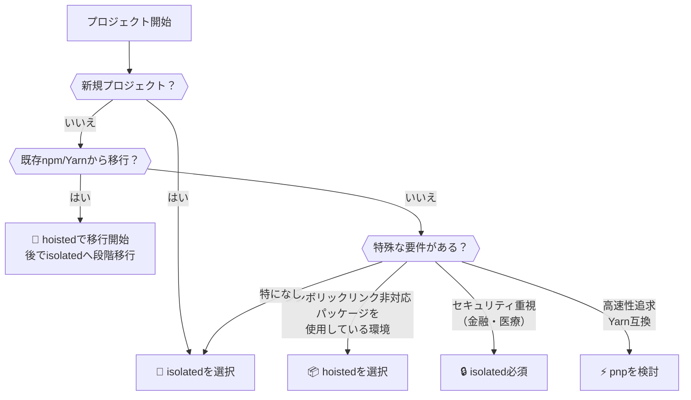

## はじめに

pnpmのメジャーアップデート後、CI環境で謎のエラーに遭遇。原因は`.npmrc`の`node-linker=hoisted`設定でした。

これを`isolated`に変更して問題は解決しましたが、そもそも`node-linker`とは何なのでしょうか？

この記事では、pnpmの`node-linker`オプション（`isolated`、`hoisted`、`pnp`）の仕組みとメリット・デメリットを徹底解説します。

## pnpmの基本的な仕組み

`node-linker`オプションを理解するには、まずpnpmの基本的な仕組みを知る必要があります。pnpmは他のパッケージマネージャーとは異なる独自のアプローチで依存関係を管理しています。

### pnpmの3つの核心技術

pnpm（Performant NPM）は、以下の3つの技術を組み合わせて、ディスクスペースの節約と高速なインストールを実現しています：

1. **コンテンツアドレス可能ストア（CAS）**
2. **ハードリンクとシンボリックリンク**
3. **仮想ストア（`.pnpm`ディレクトリ）**

#### 1. コンテンツアドレス可能ストア（CAS）


CASは、パッケージのファイル内容に基づいてハッシュ値を計算し、重複を排除する仕組みです。

:::details CASの詳細な仕組み
同じパッケージの同じバージョンが複数のプロジェクトで使用されても、実際のファイルはCAS内に1つだけ保存されます。また、異なるバージョンでもファイル内容が同一なら、1つだけ保存されます。

CASの保存場所は通常ユーザーのホームディレクトリ配下ですが、`.npmrc`の`store-dir`設定で変更可能です。
:::

#### 2. ハードリンクとシンボリックリンク


pnpmは2種類のリンクを使い分けてCASとプロジェクトを繋ぎます：

- **ハードリンク**: CASから`.pnpm`ディレクトリへファイルを効率的にコピー
- **シンボリックリンク**: `node_modules`内でパッケージへのショートカットを作成

:::details リンクの詳細な説明
ハードリンクは同じファイルへの別名で、追加のディスクスペースをほぼ消費しません。pnpmは`package-import-method`設定（デフォルト`auto`）により、可能な限り`clone`（copy-on-write）や`hardlink`を使用し、利用できない場合のみ`copy`にフォールバックします。

シンボリックリンクは、パッケージ間の依存関係を表現し、実際のファイルが配置されている`.pnpm`ディレクトリを指し示すために使用されます。
:::

#### 3. 仮想ストア（`.pnpm`ディレクトリ）

`.pnpm`ディレクトリは、プロジェクトの全ての依存関係（直接・間接）の実際のファイルが格納される場所です。パッケージは`パッケージ名@バージョン`形式で整理されています。

:::message
この仮想ストア構造により、pnpmは**効率性**（ファイル重複の排除）と**厳格性**（ファントム依存（後述）の防止）を同時に実現しています。
:::

### node-linkerオプションとは？

`node-linker`は、pnpmが`node_modules`の構造をどう生成するかを決定する重要な設定です。

:::message
`node-linker`の選択は以下に影響します：
- プロジェクトの互換性（ツールが正しく動作するか）
- 依存関係の厳格さ（ファントム依存を防げるか）
- 開発・デプロイの効率性
:::

pnpmは理想（厳格な依存管理）と現実（ツールの互換性）のバランスを取るため、3つのオプションを提供しています。

## node-linkerオプションの詳細

### 1. `isolated`（デフォルト） - pnpmの理想形

`isolated`はpnpmの核心技術（CAS、リンク、仮想ストア）をフル活用するデフォルトモードです。

#### 動作の仕組み

1. CASから`.pnpm`ディレクトリへパッケージをハードリンク
2. `node_modules`直下に直接依存へのシンボリックリンクを作成
3. Node.jsはシンボリックリンクを辿って実際のファイルに到達

#### node_modulesの構造

```text
プロジェクトルート/
├── package.json (foo, baz を依存関係として宣言)
└── node_modules/
    ├── foo (シンボリックリンク)  -> ./.pnpm/foo@1.0.0/node_modules/foo
    ├── baz (シンボリックリンク)  -> ./.pnpm/baz@1.0.0/node_modules/baz
    └── .pnpm/  # 仮想ストア
        ├── foo@1.0.0/node_modules/foo/  # foo の実際のファイル
        │   └── node_modules/
        │       └── bar (シンボリックリンク) -> ../../bar@<バージョン>/node_modules/bar  # foo の依存 bar
        ├── baz@1.0.0/node_modules/baz/  # baz の実際のファイル
        │   └── node_modules/
        │       └── bar (シンボリックリンク) -> ../../bar@<バージョン>/node_modules/bar  # baz の依存 bar
        ├── bar@<バージョン>/node_modules/bar/  # bar の実際のファイル
        └── node_modules/  # セミストリクト ホイスティング用 (hoist=true の場合)
            ├── foo (シンボリックリンク) -> ../foo@1.0.0/node_modules/foo
            ├── bar (シンボリックリンク) -> ../bar@<バージョン>/node_modules/bar
            ├── baz (シンボリックリンク) -> ../baz@1.0.0/node_modules/baz
            └── ... (その他ホイストされた全パッケージへのリンク)
```

**重要なポイント：**
- ルート`node_modules`には直接依存のシンボリックリンクのみ
- `.pnpm`ディレクトリに全パッケージの実体が格納
- `package.json`に明記していない依存へのアクセスを防止（ファントム依存の防止）

:::details Semi-strictモードについて
デフォルト設定（`hoist=true`）では、`.pnpm/node_modules`ディレクトリが作成され、依存パッケージ同士は間接依存にアクセス可能になります。これは既存のnpmパッケージとの互換性を保つための仕組みです。

アプリケーションコードからは厳格にアクセス制限しつつ、パッケージ間では柔軟性を持たせる「準厳格」なアプローチです。
:::


#### メリット

- **ディスク容量を大幅節約** - 同一パッケージは一度だけ保存
- **高速インストール** - 既存パッケージはリンクのみで再利用
- **厳格な依存管理** - ファントム依存を防止
- **再現性のあるビルド** - pnpm-lock.yamlで完全に固定

#### デメリット

- **シンボリックリンク非対応環境で問題** - 一部のサーバーレス環境など
- **学習コスト** - npmと異なる構造に慣れが必要

#### おすすめ利用シーン

- モダンなJavaScript/TypeScriptプロジェクト全般
- モノレポ環境
- ファントム依存を許容したくないプロジェクト

:::message
`isolated`はpnpmの核心的価値（ディスク効率と厳格な依存管理）を最も体現したモードです。特別な理由がない限り、このデフォルト設定の使用を推奨します。
:::

### 2. `hoisted` - 互換性重視モード

npmやYarn Classic v1と同様のフラット構造を採用し、シンボリックリンクを使用しないモードです。

#### 動作の仕組み

- 依存パッケージを`node_modules`のトップレベルに「巻き上げ」（hoist）
- シンボリックリンクは基本的に使用しない
- 直接依存も間接依存もルート直下に配置
- Yarnのホイスティングライブラリを利用

パッケージファイル自体は、`pnpm`のグローバル`CAS`から効率的に取得される可能性があります（キャッシュやダウンロードの効率性という点では`pnpm`の恩恵を受けられます）。しかし、プロジェクトの`node_modules`ディレクトリ内には、実際のファイルがコピーされたり、Yarnのホイスティングライブラリが決定するアルゴリズムに従って配置されたりします。

#### node_modulesの構造

```text
プロジェクトルート/
├── package.json (foo, baz を依存関係として宣言)
└── node_modules/  (hoisted モード)
    ├── foo/  # foo の実際のファイル群 (直接依存)
    ├── bar/  # bar の実際のファイル群 (foo または baz からホイストされた間接依存)
    ├── baz/  # baz の実際のファイル群 (直接依存)
    ├── ... (その他多くのホイストされたパッケージがフラットに配置)
    └── .pnpm/  # (ストア管理のための最小限のディレクトリ、通常は意識しない)
```

**ポイント：**
- npmやYarn Classicと同様のフラット構造
- 直接依存も間接依存もルート直下に配置
- シンボリックリンクを使用しない


#### メリット

- **優れた互換性** - シンボリックリンク非対応環境でも動作

#### デメリット

- **pnpmの主要メリット喪失** - ディスク節約、厳格な依存管理が無効化
- **ファントム依存の発生** - 未宣言の依存にアクセス可能に

#### おすすめ利用シーン

- シンボリックリンク非対応ツールを使用する場合
- `bundledDependencies`を使用する場合
- `--preserve-symlinks`フラグが必要な場合

:::message alert
`hoisted`はpnpmの主要メリットを犠牲にする最終手段です。まずは`public-hoist-pattern`設定で特定パッケージのみホイストすることを検討してください。
:::


### 3. `pnp` (Plug'n'Play) - 最速・最厳格モード

Yarn Berryで導入されたPlug'n'Playをpnpmで使用するモードです。`node_modules`をほぼ生成せず、`.pnp.cjs`ファイルでモジュール解決を制御します。

#### 動作の仕組み

- `.pnp.cjs`ファイルが全ての依存関係情報を管理
- Node.jsの`require()`をフックしてモジュール解決を制御
- ファイルシステムの探索をバイパスして高速化
- パッケージはzip圧縮で保存可能

#### メリット

- **最速のインストールと実行** - I/Oオーバーヘッドを大幅削減
- **最も厳格な依存管理** - ファントム依存を完全に排除
- **ディスク容量をさらに節約** - zip圧縮でパッケージを保存
- **Zero-installs対応** - キャッシュをGit管理してinstall不要に
- **高い安定性** - ファイルが揃えば常に動作

#### デメリット

- **エコシステムの互換性問題** - 多くのツールがPnP未対応
- **パッケージのパッチが必要** - 古いパッケージは`packageExtensions`で修正
- **デバッグが複雑** - node_modulesを直接確認できない
- **導入コストが高い** - チーム全体の学習が必要

:::details 互換性問題の具体例
- Cypressコンポーネントテストは動作しない
- IDEに専用のSDKインストールが必要
- 一部のバンドラー・テストツールが未対応
:::

#### おすすめ利用シーン

- Yarn Berryとの互換性が必要な場合
- パフォーマンスが最優先の大規模プロジェクト
- Zero-installsを実現したい場合
- PnP対応ツールのみ使用している場合

:::message alert
PnPは理論上最速・最厳格ですが、エコシステム全体のサポートが発展途上です。採用前に使用ツールのPnP対応状況を確認してください。
:::

## 比較表：`node-linker`オプション

:::message
各項目の評価基準：◎ 優秀 / ○ 良好 / △ 注意 / × 問題あり
:::

| 項目 | `isolated`（デフォルト） | `hoisted` | `pnp` |
|------|-------------------------|-----------|-------|
| **構造** | シンボリックリンク + `.pnpm` | フラット構造 | `.pnp.cjs`のみ |
| **容量効率** | ◎ | △ | ◎ |
| **速度** | ◎ | ○ | ◎ |
| **厳格性** | ◎ | × | ◎ |
| **互換性** | ○ | ◎ | △ |
| **推奨環境** | 一般的なプロジェクト | 互換性重視環境 | 実験的プロジェクト |

### 各オプションの特徴

#### 🔹 `isolated`：バランス型
- **メリット**：pnpmの利点を最大限活用、ほとんどの環境で動作
- **デメリット**：一部ツールでシンボリックリンク問題
- **こんな時に**：迷ったらこれ、新規プロジェクト

#### 🔹 `hoisted`：互換性重視
- **メリット**：従来のツールとの完全互換
- **デメリット**：pnpmの利点を失う、ファントム依存の問題
- **こんな時に**：サーバーレス、既存プロジェクト移行

#### 🔹 `pnp`：革新型
- **メリット**：最高速度、最高厳格性
- **デメリット**：ツール対応が限定的、デバッグが複雑
- **こんな時に**：実験的プロジェクト、Yarn互換が必要な場合

## `node-linker`と`.npmrc`の仲間たち：設定間の相互作用

`node-linker`オプションは、単独で機能するのではなく、`.npmrc`ファイル内に記述される他の様々な設定項目と相互作用し、その動作が調整されることがあります。特に、`symlink`設定や、ホイスティングに関連する各種設定（`hoist`, `hoist-pattern`, `public-hoist-pattern`など）は、`node-linker`の効果に重要な影響を与える可能性があります。

### `symlink`設定との関係

`symlink`設定は、`pnpm`がプロジェクトの`node_modules`ディレクトリや、その内部の仮想ストア（`.pnpm`）を構築する際に、シンボリックリンクを使用するかどうかを決定する基本的なオプションです。

*   **`node-linker=pnp`を使用する場合**:
    このケースでは、`symlink=false`に設定することが強く推奨されます。前述の通り、PnPは`.pnp.cjs`ファイルを通じて独自のモジュール解決メカニズムを持っているため、`pnpm`の標準的なシンボリックリンク生成方式は不要であるか、むしろPnPシステムと衝突を引き起こす可能性があるからです。`symlink=false`に設定することで、`pnpm`は仮想ストアディレクトリ（`.pnpm`）をシンボリックリンクなしで生成するか、あるいは最低限のシンボリックリンクのみを使用するようになります。

*   **`node-linker=isolated`を使用する場合**:
    このオプションは`pnpm`のデフォルトのシンボリックリンク戦略に従うため、通常は`symlink=true`（デフォルト値）の設定と共に使用されます。もし`symlink=false`に設定してしまうと、`isolated`リンカーの核心であるシンボリックリンクベースの構造が正しく機能しなくなる可能性があります。

*   **`node-linker=hoisted`を使用する場合**:
    `hoisted`リンカーは、その定義上、シンボリックリンクを使用せずにフラットな`node_modules`を生成します。したがって、`symlink`設定の値は、このリンカーの主要な動作方式には大きな影響を与えないと考えられます。ただし、`pnpm`が内部的にストアからパッケージを取得する方法など、間接的な部分では影響を与える可能性もゼロではありません。

### ホイスティング関連設定 (`hoist`, `hoist-pattern`, `public-hoist-pattern`) の影響

これらのホイスティング関連の設定は、主に`node-linker=isolated`（デフォルト値）と組み合わせて使用される場合に意味を持ちます。これらは、`pnpm`の厳格な依存関係管理ポリシーを特定の要求に合わせて部分的に緩和したり、特定のパッケージとの互換性問題を解決したりするのに役立ちます。これらは、いわば`isolated`モードの厳格さからの一時的な「避難ハッチ（escape hatches）」として機能します。

*   **`hoist` (デフォルト値: `true`)**:
    この設定が`true`の場合、`pnpm`は`node_modules/.pnpm/node_modules`ディレクトリ内部に、仮想ストア（`.pnpm`）に存在する全てのパッケージへのシンボリックリンクを生成します。これにより、インストールされたある依存パッケージが、他の（自身に直接的には宣言されていない）依存パッケージを`require`できるようになります。これが`pnpm`の「準厳格 (semi-strict)」な動作の核心です。もし`hoist=false`に設定すると、この内部的なホイスティングメカニズムが無効化され、各依存パッケージは自身の`package.json`に明示された直接的な依存関係のみにアクセスできるようになります。

*   **`hoist-pattern` (デフォルト値: `['*']`)**:
    `node_modules/.pnpm/node_modules`ディレクトリへとホイスティング（つまり、シンボリックリンクを作成）するパッケージを、globパターンで指定します。デフォルトでは全てのパッケージ（`*`）をホイストします。もし、特定の欠陥のあるパッケージだけがファントム依存を必要としていることが分かっている場合、このオプションを使用して該当するパッケージだけを選択的にホイストすることで、ファントム依存による潜在的な問題を最小限に抑えつつ互換性を確保することが推奨されます。

*   **`public-hoist-pattern`**:
    `hoist-pattern`と似ていますが、パッケージを隠された`node_modules/.pnpm/node_modules`ではなく、プロジェクトルートの`node_modules`ディレクトリへと直接ホイスティング（シンボリックリンクを生成）します。これにより、アプリケーションのコード自体も該当するファントム依存にアクセスできるようになるため、使用には慎重を期す必要があります。主に、TypeScriptの型定義ファイル（`*types*`や`@types/*`など）や、ESLint関連のパッケージ（`eslint-config-*`や`eslint-plugin-*`など）のように、プロジェクト全体からアクセスする必要がある特定のツールパッケージをホイスティングするのに便利です。

`node-linker=hoisted`オプションを使用している場合、`pnpm`自体が全ての依存関係をルートの`node_modules`へとフラットにホイストしようと試みるため、上で述べたような詳細なホイスティングパターン設定（`hoist`, `hoist-pattern`, `public-hoist-pattern`）の意味は薄れるか、あるいは異なる動作をする可能性があります。
→`hoisted`リンカーはYarnのホイスティングライブラリを使用するため、`pnpm`自体のホイスティングロジックとは異なる振る舞いをする可能性があるからです。

## セキュリティ面での比較

### ファントム依存とセキュリティリスク

**ファントム依存**とは、`package.json`に宣言されていないパッケージが使用可能になってしまう問題です。これは重大なセキュリティリスクとなる可能性があります。

:::message alert
ファントム依存は、悪意のあるコードへの意図しないアクセスや、依存関係混乱攻撃のリスクを高めます。
:::

### 各リンカーのセキュリティ特性

| リンカー | ファントム依存防止 | 攻撃表面 | 推奨度 |
|---------|-------------------|----------|--------|
| **isolated** | ◎ 効果的に防止 | 小さい | ◎ セキュリティ重視プロジェクトに最適 |
| **hoisted** | × 発生可能性高 | 大きい | △ 追加の対策が必要 |
| **pnp** | ◎ 原理的に防止 | 最小 | ○ `.pnp.cjs`の完全性に依存 |

:::details セキュリティ対策のポイント
- **isolated使用時**：デフォルトで安全。`public-hoist-pattern`の使用は最小限に
- **hoisted使用時**：静的解析ツールの導入、コードレビューの強化が必須
- **pnp使用時**：`.pnp.cjs`ファイルの改竄防止、PnPローダーの更新管理
:::

:::message
**結論**：セキュリティが重要な場合は`isolated`を選択し、`hoisted`は避けるべきです。
:::

## まとめ：`node-linker`選択フローチャート



### 📝 各シチュエーション別推奨

#### ✅ 迷ったら`isolated`
- ほとんどのプロジェクトに最適
- pnpmの利点を最大限活用
- 互換性問題は`public-hoist-pattern`で解決

#### 🔄 移行プロジェクト
1. まず`hoisted`で安定稼働を確認
2. 段階的に`isolated`へ移行
3. 問題があれば`public-hoist-pattern`で対応

#### 📦 互換性重視環境
- シンボリックリンク非対応環境

#### ⚡ 実験的プロジェクト
- 最高速度を追求
- Yarn PnPとの互換性が必要
- ツールサポートを事前確認必須

:::message alert
**重要**：`node-linker`の選択はプロジェクトの長期的な成功に影響します。慎重に選択し、必要に応じて再評価してください。
:::

### 💡 プロティップス

:::details 困ったときのトラブルシューティング
1. **シンボリックリンクエラー**
   - `public-hoist-pattern`で特定パッケージをホイスト
   - または`hoisted`に変更

2. **ファントム依存の問題**
   - `pnpm ls`で依存関係を確認
   - 明示的に`package.json`に追加

3. **パフォーマンス問題**
   - `store-dir`の位置を最適化
   - `package-import-method`を調整
:::

## 最後に

`pnpm`の`node-linker`は、プロジェクトの重要な戦略的選択ということをお分かりいただけたでしょうか。
正しい選択をすることで、ディスクスペースの効率性とセキュリティを大幅に向上させることができます。

:::message
**覆えておきたいポイント**
- 🎯 迷ったら`isolated`から始める
- 🔄 移行時は`hoisted`でスムーズに
- 🔒 セキュリティ重視なら`isolated`一択
- ⚡ 最高速度を求めるなら`pnp`を検討
:::

`pnpm`は今も活発に開発され、進化し続けています。この記事が、皆さんのプロジェクトで`pnpm`をより効果的に活用するためのガイドとなれば幸いです。

ぜひ、皆さんのプロジェクトでも最適な`node-linker`を見つけ、その経験をコミュニティで共有してくださいね！
